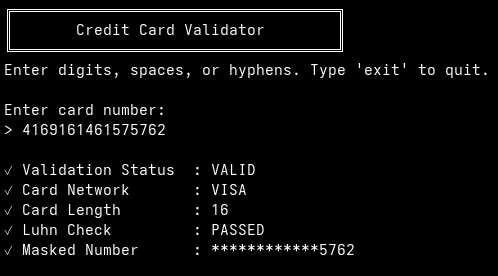
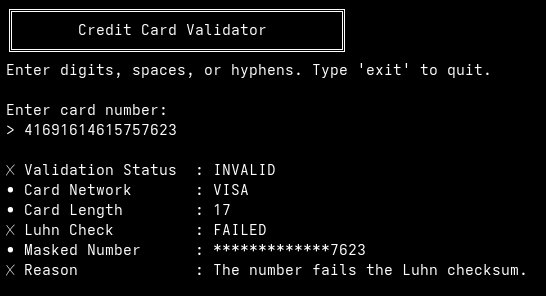
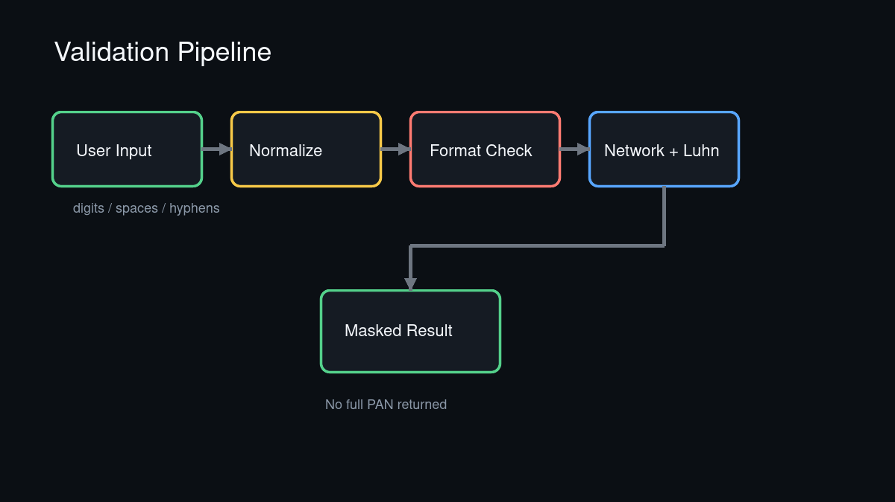

# Credit Card Validator

<table><tr><td></td><td></td></tr></table>

A Java command-line application that performs basic offline validation of payment card numbers.

It validates input format, card-network prefixes, supported lengths, and the Luhn checksum. Valid numbers are displayed in masked form so the full number is not returned in the result.

## Features

- **Input normalization** — Accepts digits, spaces, and hyphens
- **Card network detection** — Supports Visa, Mastercard, American Express, Discover, JCB, UnionPay, RuPay, Maestro, Diners Club, and Mir
- **Luhn checksum validation** — Verifies card numbers using the industry-standard Luhn algorithm
- **Secure card masking** — Returns only masked numbers with last four digits visible
- **GitHub Actions CI** — Automated build and test pipeline

## Project Structure



```text
credit-card-validator/
├── .github/workflows/ci.yml    # CI/CD pipeline
├── docs/screenshots/            # Project documentation assets
├── src/
│   └── CreditCardValidator.java
├── tests/
│   └── CreditCardValidatorTest.java
├── build/                       # Generated locally (ignored by Git)
├── .gitignore
├── LICENSE
└── README.md
```

## How It Works

1. **Input Normalization** — Removes spaces and hyphens, validates that only digits remain
2. **Length Check** — Ensures the card number is between 12 and 19 digits
3. **Prefix Matching** — Identifies the card network based on BIN (Bank Identification Number) ranges
4. **Luhn Algorithm** — Validates the checksum to detect typos and invalid numbers
5. **Masking** — Replaces all but the last four digits with asterisks for secure display

## Requirements

- Java JDK 8 or newer

## Build

```bash
mkdir -p build/java
javac -Xlint:all -d build/java src/CreditCardValidator.java
```

## Run

```bash
java -cp build/java CreditCardValidator
```

Type a card number and press Enter. Type `exit` to quit.

## Test

```bash
javac -Xlint:all -cp build/java -d build/java tests/CreditCardValidatorTest.java
java -cp build/java CreditCardValidatorTest
```

## Example Output

```text
╔════════════════════════════════════╗
║       Credit Card Validator        ║
╚════════════════════════════════════╝
Enter digits, spaces, or hyphens. Type 'exit' to quit.

Enter card number:
> 4111 1111 1111 1111

✓ Overall Status : VALID
✓ Card Network      : VISA
✓ Card Length       : 16
✓ Luhn Check        : PASSED
✓ Masked Number     : ************1111

Enter card number:
> 4111111111111121

✗ Validation Status : INVALID
• Card Network      : VISA
• Card Length       : 16
✗ Luhn Check        : FAILED
✗ Reason            : Invalid card length and failed checksum.
```

## Public Test Numbers

Use only public test numbers:

| Network | Number |
| --- | --- |
| Visa | `4111111111111111` |
| Mastercard | `5500000000000004` |
| American Express | `378282246310005` |
| Discover | `6011000990139424` |
| JCB | `3530111333300000` |

## Important Limitation

This application does not confirm that a card exists, is active, has available funds, or belongs to a particular customer. It is an offline validation utility, not a payment processor.

For production payments, collect and tokenize card details through a PCI-compliant provider such as Stripe, Adyen, Braintree, Razorpay, or another approved gateway. Never log or store complete card numbers.

## License

Licensed under the [MIT License](LICENSE).
